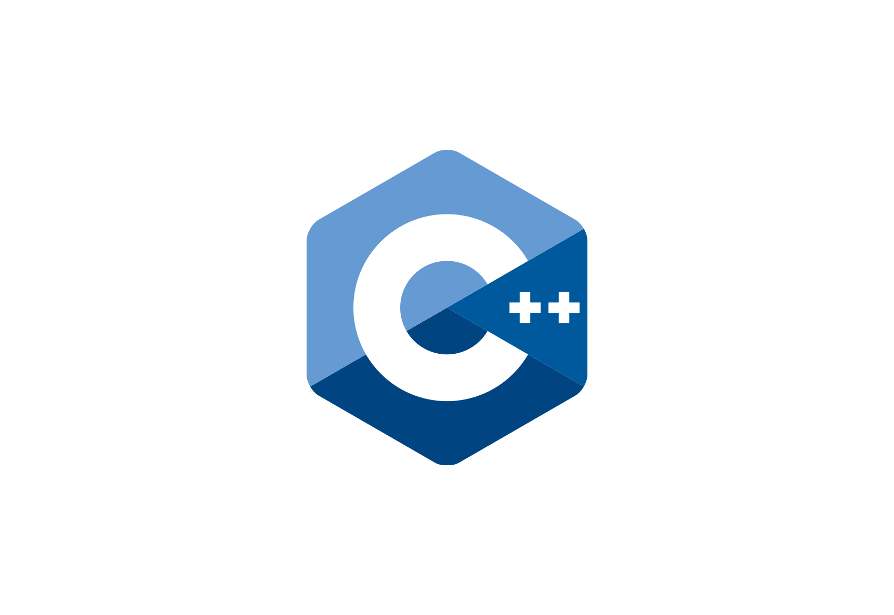

### Hi there, I'm Girik Bajaj 👋
- 🔭 I just launched my first portfolio website: [Girik's Portfolio](https://bajajgirik.github.io/Portfolio-GirikBajaj/)
- 🌱 I'm currently learning everything 🤣
- 👯 I’m looking to collaborate with other open source enthusiasts on some 😎cool projects
- 🥅 2021 Goals: Learn more about backend technologies
- ⚡ Fun fact: I am looking forward for the official release of BGMI
---

### Connect with me:

[Gmail:  ](https://mail.google.com/mail/u/0/?fs=1&tf=cm&source=mailto&to=bajajgirikoff2@gmail.com)
[LinkedIn:  ](https://www.linkedin.com/in/girik-bajaj/)
[Instagram:  ](https://www.instagram.com/girik_bajaj/)
[Facebook:  ](https://www.facebook.com/girik.bajaj.9/)

### Languages and Tools 🛠:

